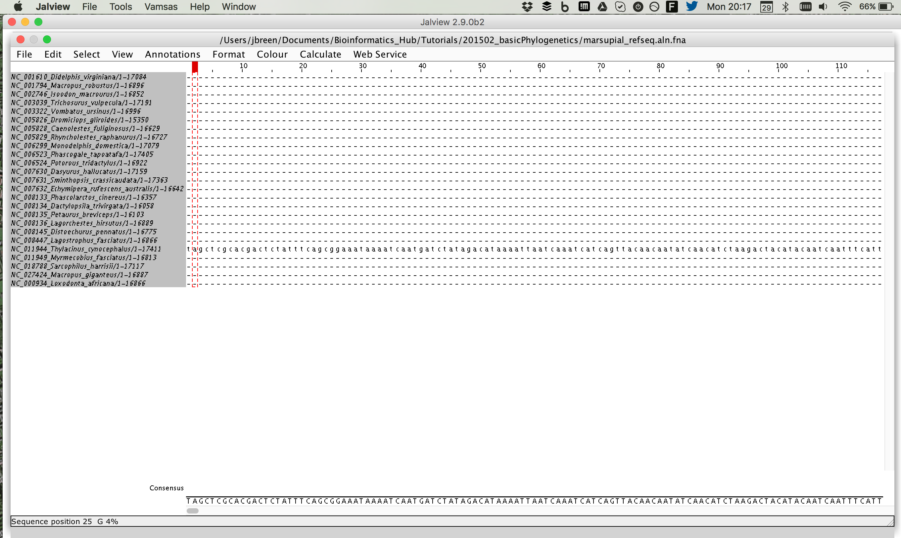
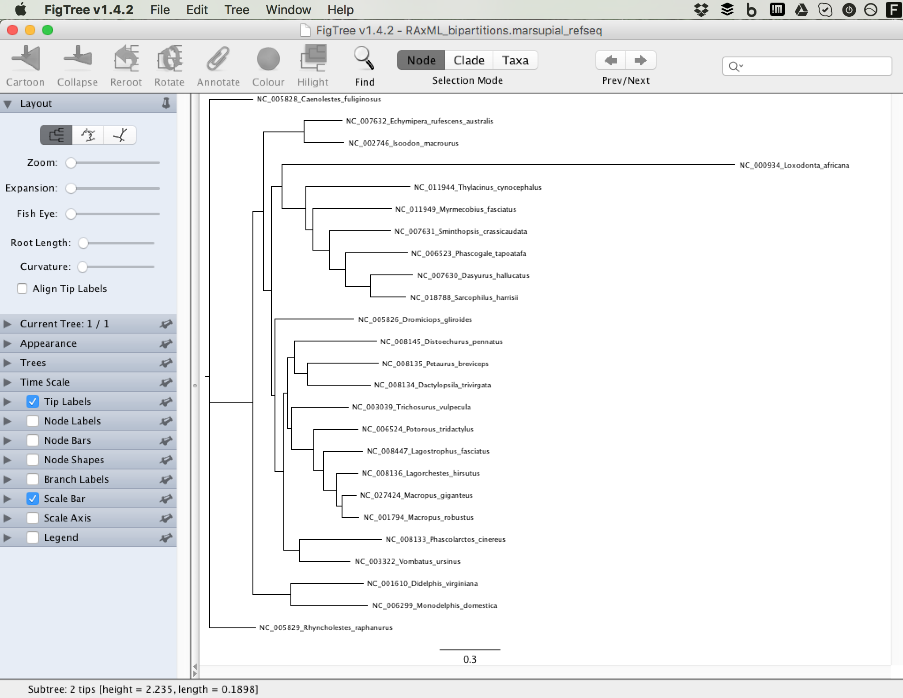

# Basic Phylogeny for Command-line Tutorial

In this tutorial we are going to do a very quick phylogenetic analysis of 24 Marsupials (https://en.wikipedia.org/wiki/Marsupial) using whole mitochondrial genomes. Whole mitochondrial genomes are great for phylogenetic reconstruction because they're non-recombining and are relatively fast evolving, meaning that we can delineate species. 

To construct a phylogenetic tree we need sequences! The directory contains a file called "marsupial_refseq.fasta" which contains 24 Marsupial whole mitochondrial genomes and closely related but non-marsupial genome of the African Elephant (*Loxodonta africana*). You can view the data by using the unix commands *more* or *less*

`less marsupial_refseq.fasta`

The fasta files should all contain a header line (starting with ">") that has the RefSeq accession number (e.g. NC_001610) followed by the species name. The next line is the sequence`

All these sequences are should be conserved between species, so we can go ahead and align them using MAFFT. MAFFT is a multiple sequence aligner which can align both long and short conserved sequences. It can take many alignment formats but for this task we will use fasta format (both for input and output)

`mafft marsupial_refseq.fasta > marsupial_refseq.aln.fna`

Note: To stop confusing the aligned and non-aligned fasta file, use the ".fna" file extension

The file has the same header and sequence lines, but gapped regions (sequences that are not present in the aligned data) are represented as a dash "-". Where there is sequence (i.e. ACGT's) the sequence aligns.

Now its a little difficult to view this alignment on command-line so lets use Jalview:

`javaws http://www.jalview.org/webstart/jalview.jnlp`

This will start installing a java application that allows you to view the alignment. Once the program opens up, load the alignment into the program (using the File menu). The alignment should look like this:

Have a look around!

The first part of the sequence has a lot of gaps in it, which may mess with the alignment a bit, so lets delete this sequence up until the part where all sequence seem to align (around 980 bp). Once you get to the part where all sequences line up, click on the top of the alignment (which adds a red column ontop of the data) and then remove all sequences left of that point by clicking "remove left" (command-L) in the Edit menu. 

Do the same thing to the last part of the sequence by removing the right sequence after where all the sequences no longer align (around 15,950 bp). 

Once thats done, lets save the file as "marsupial\_refseq.aln_edit.fna". Unfortunately, Jalview does some weird stuff to the files so we need to rename the file and also get rid of some things that were added to the fasta header.

They seem to have added the bp alignment position to the header, so lets delete this using unix sed:

`sed 's/\/.*$//g' marsupial_refseq.aln_edit.fna.mfa > marsupial_refseq.aln_edit.fna`

This command substitutes everything from the "/" to the end of the header line and saves the file as a new file. This allows us to get rid of that ".mfa" extension that we didnt need too!

Now lets build a tree!

Before that we need to convert the fasta alignment to phylip format. To do this, we'll need to use python's interactive shell and the module biopython:

`python`

The shell should change a little and show something like this:
`LC02K51MKFFT1:201502_basicPhylogenetics jbreen$ python`
`Python 2.7.11 (default, Jan 22 2016, 08:29:18)`
`[GCC 4.2.1 Compatible Apple LLVM 7.0.2 (clang-700.1.81)] on darwin`
`Type "help", "copyright", "credits" or "license" for more information.`
`>>>`

Now we need to run a few commands to convert the fasta alignment to phylip:

`>>> from Bio import AlignIO`
`>>> AlignIO.convert("marsupial_refseq.aln_edit.fna", "fasta", "marsupial_refseq.phy", "phylip-relaxed")`
`1`
`>>>`

To escape the python interactive shell run "Command-D"

In the directory there should be a bash shell in which we will edit in order to run RAxML. The shell is what we call a "wrapper" which is just a script that runs the program inside another. This allows the user to make sure everything is stable and so we can control the inputs and outputs easily. This shell also contains extra info about the different ways you can run RAxML (different models etc). 

You can have a look at the file by running:
`less marsupial_refseq.phy`

For now we're just going to run 10 bootstraps (statistical tests) on the data, but you can always edit the file later to add more. The more bootstraps generally means the greater support

So lets run RAxML:

`./run_raxml marsupial_refseq.phy`

After some time (usually 5-10 minutes) we should have some trees to look at. Lets use figtree for that:

`open /Users/jbreen/Applications/FigTree\ v1.4.2.app`

Note: You can replace "jbreen" with your username

RAxML made quite a few files:
`RAxML_bestTree.marsupial_refseq`
`RAxML_bipartitions.marsupial_refseq`
`RAxML_bipartitionsBranchLabels.marsupial_refseq`
`RAxML_bootstrap.marsupial_refseq`
`RAxML_flagCheck`
`RAxML_info.marsupial_refseq`

The file we need to have a look at it "RAxML_bipartitions.marsupial_refseq". Once you open the file, you will be prompted to name the labels on the figure. Type "boostraps"

Your new tree should look like this:

We want to also show the boostrap values on the tree too. You can do this by opening the "Node Labels" box (making sure its checked) and then choosing "boostraps" in the display dropdown menu.

Because we have an outgroup, we know that one sample should be outside our Marsupial clade. On the figure, click on "NC_000934_Loxodonta_africana" and then choose "Reroot" which is the third top left icon at the top of the window. 

TA DA! We have a rooted phylogenetic tree of the Marsupial mitochondrial genomes!

## Practise makes perfect

Ok now you can try a few extra things such as:
- Try adding new mitochondrial genomes 
- Run the phylogeny with more boostraps
